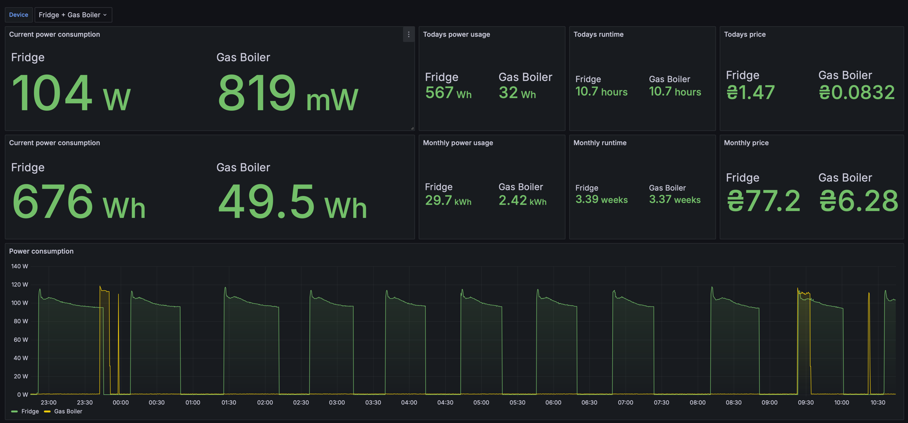
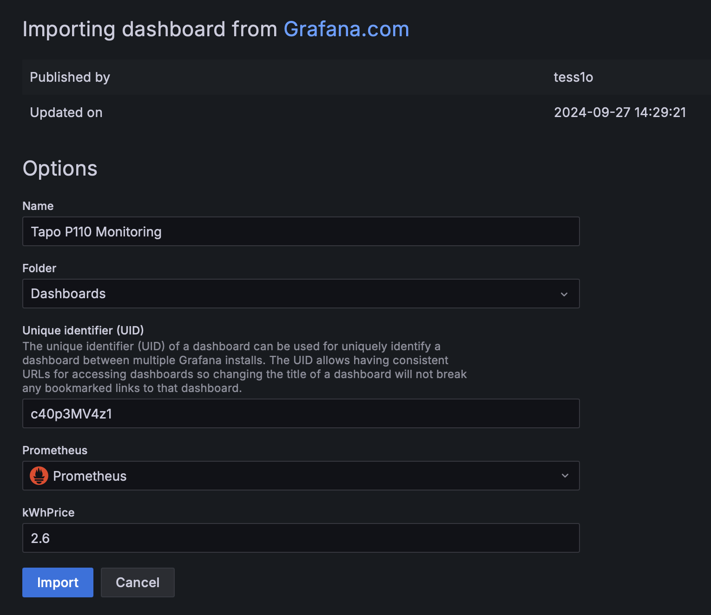
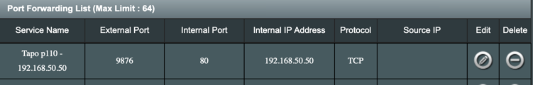

# TP-Link Tapo P110 Prometheus exporter

## Description

This is an TP-Link Tapo P110 and Tapo H200 Prometheus exporter written in Go. It collects the data from P110 devices as
well as H200 hub (and connected devices) and sends them to Prometheus, where they can be visualized in Grafana.

Currently supported and tested:

1. P110
2. H200 hub with T310 and T315 sensors (temperature + humidity)

Other devices that are connected to H200 hub can be supported, however I don't have any (expect T310 and T315) so will
need additional help from the community.

### Dashboard



## Installation via docker compose

1. `cd docker-compose`
2. Update `TAPO_EMAIL` and `TAPO_PASSWORD` in `docker-compose.yml` or use environment variables (preferable)
3. Update `config.json` and add P110 devices and/or H200 hub with meaningful names and their IP addresses (or host:port, see below how
   to configure everything to work via Internet)
4. Run `docker compose up` or `docker compose up -d`

The exporter is running on port 8086, Prometheus on port 9090 and Grafana on port 3000.

## Installation without Prometheus and Grafana via docker-compose

1. Create `config.json` in current directory with content (update it as per your devices and hosts)

```json
{
  "smart_plugs": [
    {
      "name": "Fridge",
      "host": "192.168.1.2"
    },
    {
      "name": "Gas Boiler",
      "host": "192.168.1.3"
    }
  ],
  "t_series": [
    {
      "hub_host": "192.168.1.4"
    }
  ]
}

```

2. Create docker-compose.yaml file (update email and password)

```yaml
services:
  go-tapo-exporter:
    image: tess1o/go-tapo-exporter:latest
    container_name: go_tapo_exporter
    volumes:
      - ./config.json:/app/config.json:ro
    ports:
      - 8086:8086
    environment:
      - TAPO_EMAIL=CHANGE_ME
      - TAPO_PASSWORD=CHANGE_ME
      - TAPO_CONFIG_LOCATION=/app/config.json
```

3. Run `docker compoe -f docker-compose.yaml up -d`

## Installation without Prometheus and Grafana via docker run

1. Create `config.json` in current directory with content (update it as per your devices and hosts)

```json
{
  "smart_plugs": [
    {
      "name": "Fridge",
      "host": "192.168.1.2"
    },
    {
      "name": "Gas Boiler",
      "host": "192.168.1.3"
    }
  ],
  "t_series": [
    {
      "hub_host": "192.168.1.4"
    }
  ]
}

```

2. Run docker run command (update email and password)

`docker run -d --name go_tapo_exporter -v ./config.json:/app/config.json:ro -p 8086:8086 -e TAPO_EMAIL=CHANGE_ME -e TAPO_PASSWORD=CHANGE_ME -e TAPO_CONFIG_LOCATION=/app/config.json tess1o/go-tapo-exporter:latest`

Go to Grafana (http://localhost:3000, admin/admin), configure `Prometheus` datasource (url should
be http://prometheus:9000).
In Grafana import dashboard `21982` and selected the `Prometheus` datasource:



## How to use the exporter via Internet

All existing solutions require the server to be located in the same network as P110 devices, since we send requests
directly to them. There is a workaround how to run this setup on external server (some VPS for instance).

Here is an example how I did it using ASUS router.

1. Configure static IP address for P110 device (in my example it's `192.168.50.50`). You can select any local IP
   address, it doesn't matter
2. Configure port forwarding from external PORT (let's say `9876` to `192.168.50.50:80`
   
3. Configure DDNS in your ASUS router (I assume other routers supports similar feature) so we have a dedicated hostname
   attached to our router. Can be skipped if you have static IP address from your provider. Let's say it's
   `example.asuscomm.com`
4. Now in `config.json` (see step #3 from installation instruction) you can use:

```json
{
  "smart_plugs": [
    {
      "name": "Fridge",
      "host": "example.asuscomm.com:9876"
    }
  ],
  "t_series": [
    {
      "hub_host": "example.asuscomm.com:8987"
    }
  ]
}

```

(pay attention I set port which we configured in step#2)

instead of

```json
{
  "smart_plugs": [
    {
      "name": "Fridge",
      "host": "192.168.50.50"
    }
  ],
  "t_series": [
    {
      "hub_host": "192.168.1.4"
    }
  ]
}

```

5. Deploy everything on external VPS.